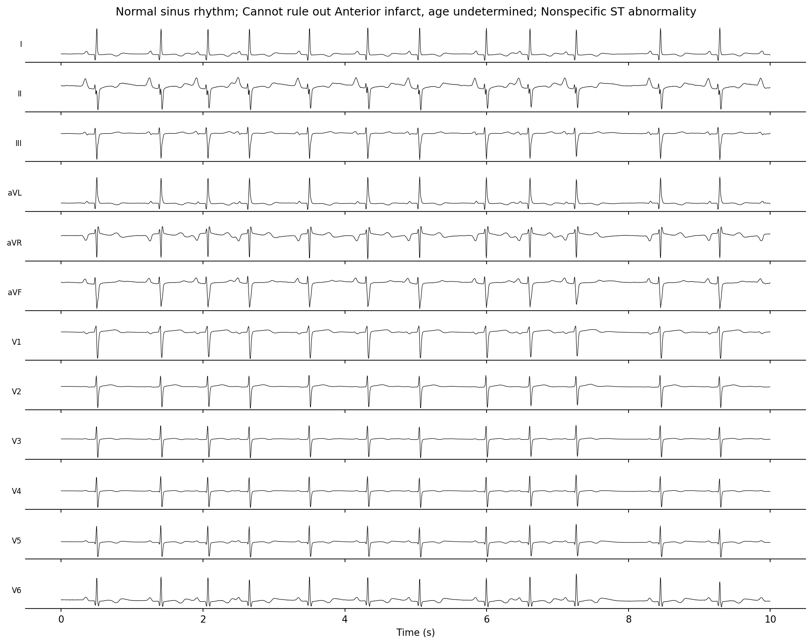
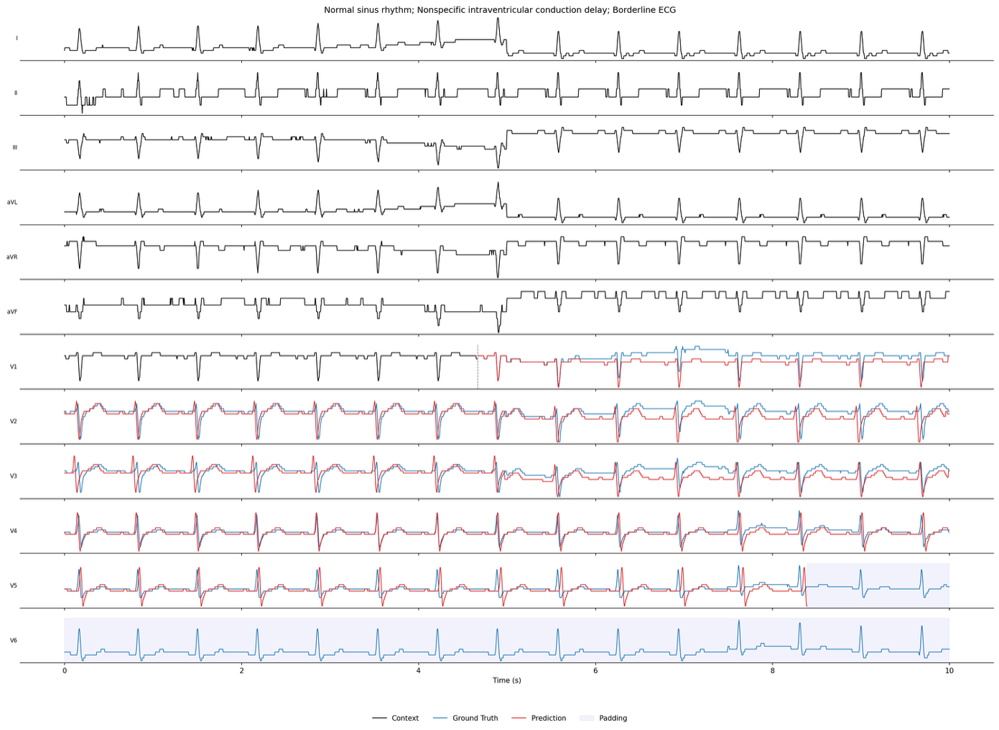

# ecg_encoder

A research framework for pretraining and evaluating ECG neural networks. Supports multiple architectures, training objectives, and data representations with distributed training out of the box.
Prepare datasets with [ecg_preprocess](https://github.com/ELM-Research/ecg_preprocess) before use.

> **Status:** Beta.

## Setup
We use torch 2.9 with cuda 12.8 and primarily use H100 GPUs.


```bash
git clone https://github.com/ELM-Research/ecg_encoder.git
cd ecg_encoder && uv sync
```

For BPE symbolic representation with [ECG-Byte](https://arxiv.org/abs/2412.14373), compile the Rust tokenizer:

```bash
cd src/dataloaders/data_representation/bpe
maturin develop --release
```

If Rust is not installed: `curl --proto '=https' --tlsv1.2 -sSf https://sh.rustup.rs | sh -s -- --default-toolchain=1.82.0 -y`

## Data

Set `DATA_DIR` in `src/configs/constants.py` to your preprocessed data directory which contains the one or more of the following subdirectories: `mimic_iv`, `ptb_xl`, `code15`, `cpsc`, `csn`. These can be preprocessed using the [ecg_preprocess](https://github.com/ELM-Research/ecg_preprocess) repository.

| Dataset  | Key        |
|----------|------------|
| PTB-XL   | `ptb_xl`   |
| MIMIC-IV | `mimic_iv` |
| CODE 15  | `code15`   |
| CPSC     | `cpsc`     |
| CSN      | `csn`      |

## Representations

| `--data_representation` | Description |
|-------------------------|-------------|
| `signal` | Raw ECG matrix $X \in \mathbb{R}^{C \times L}$ (leads × samples) |
| `bpe_symbolic` | BPE-tokenized symbolic sequence $X \in V^m$ via ECG-Byte compression |

## Models & Objectives

| Model | `--neural_network` | `--objective` | Representation |
|-------|--------------------|---------------|----------------|
| [DiT](https://arxiv.org/abs/2212.09748) | `trans_continuous_dit` | `ddpm`, `rectified_flow` | `signal` |
| [NEPA](https://arxiv.org/abs/2512.16922) | `trans_continuous_nepa` | `autoregressive` | `signal` |
| Decoder Transformer | `trans_discrete_decoder` | `autoregressive` | `bpe_symbolic` |
| [MAE ViT](https://arxiv.org/abs/2111.06377) | `mae_vit` | `mae` | `signal` |
| [MERL](https://arxiv.org/abs/2403.06659) | `merl` | `merl` | `signal` |
| [MLAE](https://ieeexplore.ieee.org/document/9980411) | `mlae` | `mlae` | `signal` |
| [MTAE](https://ieeexplore.ieee.org/document/9980411) | `mtae` | `mtae` | `signal` |
| [ST-MEM](https://arxiv.org/abs/2402.09450) | `st_mem` | `st_mem` | `signal` |

## Usage

### Pretrain

DiT with rectified flow on 8 GPUs:

```bash
CUDA_VISIBLE_DEVICES=0,1,2,3,4,5,6,7 \
uv run torchrun --standalone --nproc_per_node=8 \
    src/pretrain_encoder.py \
    --data mimic_iv \
    --data_representation signal \
    --objective rectified_flow \
    --neural_network trans_continuous_dit \
    --task pretrain \
    --batch_size 64 --distributed --ema
```

Decoder transformer with BPE tokens:

```bash
CUDA_VISIBLE_DEVICES=0,1,2,3 \
uv run torchrun --standalone --nproc_per_node=4 \
    src/pretrain_encoder.py \
    --data mimic_iv \
    --data_representation bpe_symbolic \
    --objective autoregressive \
    --neural_network trans_discrete_decoder \
    --task pretrain \
    --batch_size 64 --distributed
```

### Evaluate

Generation:

```bash
uv run src/eval_encoder.py \
    --data mimic_iv \
    --nn_ckpt path/to/checkpoint.pt \
    --data_representation signal \
    --objective rectified_flow \
    --neural_network trans_continuous_dit \
    --task generation --ema
```

Reconstruction:

```bash
uv run src/eval_encoder.py \
    --data mimic_iv \
    --nn_ckpt path/to/checkpoint.pt \
    --data_representation signal \
    --objective rectified_flow \
    --neural_network trans_continuous_dit \
    --task reconstruction --ema
```

Forecasting:

```bash
uv run src/eval_encoder.py \
    --data mimic_iv \
    --nn_ckpt path/to/checkpoint.pt \
    --data_representation bpe_symbolic \
    --objective autoregressive \
    --neural_network trans_discrete_decoder \
    --task forecasting --forecast_ratio 0.5
```

### Conditional Generation

```bash
# Lead-conditioned
... --condition lead --condition_lead 1

# Text-conditioned
... --condition text --text_feature_extractor Qwen/Qwen3-0.6B
```

### Examples

Text-conditioned 12-lead ECG generation (DiT + DDPM):



ECG forecasting (decoder transformer + BPE tokens, 50% context):



### Key Flags

| Flag | Description |
|------|-------------|
| `--distributed` | Multi-GPU DDP training |
| `--ema` | Exponential moving average |
| `--torch_compile` | `torch.compile` the model |
| `--wandb` | Log to Weights & Biases |
| `--augment` | ECG data augmentation |
| `--optimizer` | `adam`, `adamw`, `muon` |
| `--lr_schedule` | `constant`, `cosine`, `inv_sqrt` |
| `--condition` | `text`, `lead`, or omit for unconditional |

## License

MIT, except `st_mem.py`, `mlae.py`, `mtae.py` which are [CC BY-NC 4.0](https://github.com/bakqui/ST-MEM?tab=License-1-ov-file#readme).
